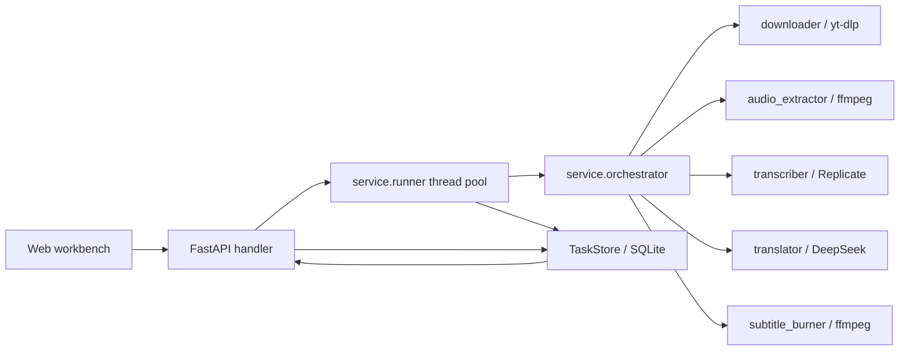

English | [简体中文](./README.md)

# Subtitles AI


Subtitles AI is a local video subtitle translation workbench. Given a video URL, it automatically downloads the video, extracts audio, transcribes speech, translates subtitles, and burns or muxes subtitles into the output video.


## 1. Product Overview

### 1.1 Project Introduction

This project is designed for personal workflows that need semi-automated video subtitle processing. You can manage jobs from the Web workbench or run the full pipeline from the command line. Transcription uses Replicate-hosted Whisper, translation uses DeepSeek, and video processing uses local FFmpeg.

### 1.2 Feature Showcase

- Process one URL through the full pipeline: download, extract audio, transcribe, translate, and generate the final video.
- Web workbench for job creation, job lists, live progress, result preview, and artifact downloads.
- CLI entry point in `main.py` with target language, source language, subtitle mode, burn mode, and model options.
- Supports translated-only subtitles and bilingual subtitles.
- Supports hard-burned subtitles and soft subtitle tracks.
- Stores intermediate artifacts in one directory per job for debugging and reuse.

### 1.3 Platform & Technology Support

| Type | Support |
| --- | --- |
| Operating systems | Currently supported and verified on macOS only; Linux / Windows are not adapted yet |
| Python | `>=3.10,<3.13`; the repository currently uses `3.11` in `.python-version` |
| Package manager | uv |
| Backend | FastAPI + Uvicorn |
| Frontend | Vanilla HTML / CSS / JavaScript ES Modules |
| Storage | SQLite with WAL mode |
| Video processing | yt-dlp, ffmpeg-full, ffprobe; hard-burned subtitles require libass |
| Cloud services | Replicate, DeepSeek |

### 1.4 Documentation Navigation

- [Quick Start](#2-quick-start)
- [Configuration & Commands](#3-configuration--commands)
- [Architecture & Project Structure](#4-architecture--project-structure)
- [Developer Guide](#5-developer-guide)
- [Contributing](#6-contributing)
- [Security Vulnerability Reporting](#64-security-vulnerability-reporting)
- [Versioning](#7-versioning)
- [License](#8-license)

### 1.5 AI Collaboration Documents

The repository currently does not include `AGENTS.md`, `CLAUDE.md`, or `.github/copilot-instructions.md`. If AI agent collaboration rules are needed, add them as separate documents and keep README as an entry point only.

## 2. Quick Start

### 2.1 Install System and Project Dependencies

The project is currently adapted for macOS only. First install `uv` and `ffmpeg-full` with `libass` via Homebrew:

```bash
brew install uv
brew tap homebrew-ffmpeg/ffmpeg
brew install ffmpeg-full
```

Do not install regular `ffmpeg` as a replacement for `ffmpeg-full`. Regular `ffmpeg` may miss `libass`, which can make hard-burned subtitles fail with `No such filter: 'subtitles'` or an unavailable subtitle filter.

Verify the system dependencies:

```bash
uv --version
ffmpeg -hide_banner -filters | grep " subtitles "
```

Then install Python project dependencies:

```bash
uv sync
```

### 2.2 Configure Environment Variables

The repository currently does not include `.env.example`; this needs to be added. Before first run, create `.env` in the project root:

```ini
REPLICATE_API_TOKEN=your Replicate token
SUBTRANS_DEEPSEEK_API_KEY=your DeepSeek key
```

`.env` is ignored by `.gitignore`. Do not commit real secrets to the repository.

### 2.3 Start the Project

Run the backend and frontend in two terminals:

```bash
uv run uvicorn src.handler.app:app --reload --port 8000
```

```bash
python3 -m http.server 5273 --directory web
```

Then open:

- Web workbench: <http://localhost:5273>
- FastAPI docs: <http://localhost:8000/docs>

### 2.4 Verify Successful Startup

```bash
curl http://localhost:8000/api/health
```

Expected response:

```json
{"ok": true}
```

The frontend uses `http://localhost:8000` by default. To override the backend URL, run this in the browser console:

```js
localStorage.setItem("SUBTRANS_API_BASE_URL", "http://localhost:8000")
```

### 2.5 Basic CLI Commands

To run without the Web UI:

```bash
uv run python main.py "<video-url>"
```

```bash
uv run python main.py "<video-url>" --target zh-CN --source auto --mode bilingual --burn hard --model small
```

## 3. Configuration & Commands

### 3.1 Environment Variables

| Variable | Required | Default | Description |
| --- | --- | --- | --- |
| `REPLICATE_API_TOKEN` | Yes | None | Replicate API token for speech transcription |
| `SUBTRANS_DEEPSEEK_API_KEY` | Yes | None | DeepSeek API key for subtitle translation |
| `DEEPSEEK_API_KEY` | No | None | Compatibility variable used when `SUBTRANS_DEEPSEEK_API_KEY` is not set |
| `SUBTRANS_DATA_DIR` | No | `./data` | Root directory for job artifacts |
| `SUBTRANS_DB` | No | `./app.db` | SQLite database path |
| `SUBTRANS_WORKERS` | No | `2` | Number of background pipeline workers |
| `SUBTRANS_CORS_ORIGINS` | No | `http://localhost:5273,http://127.0.0.1:5273` | Frontend origins allowed to access the backend API, separated by commas |
| `SUBTRANS_DL_FORMAT` | No | `bv*+ba/b` | yt-dlp format selector |
| `SUBTRANS_DL_CONTAINER` | No | `mp4` | Merged download container format |
| `SUBTRANS_DL_RETRIES` | No | `3` | Download retry count |
| `SUBTRANS_COOKIES` | No | Empty | Path to a cookies file for sites requiring login or verification |
| `SUBTRANS_FFMPEG` | No | `ffmpeg` | ffmpeg executable |
| `SUBTRANS_FFPROBE` | No | `ffprobe` | ffprobe executable |
| `SUBTRANS_AUDIO_SR` | No | `16000` | Extracted audio sample rate |
| `SUBTRANS_AUDIO_CH` | No | `1` | Extracted audio channel count |
| `SUBTRANS_WHISPER_MODEL` | No | `stayallive/whisper-subtitles:<locked-version>` | Replicate Whisper model identifier |
| `SUBTRANS_REPLICATE_TIMEOUT` | No | `1800` | Replicate inference timeout in seconds |
| `SUBTRANS_REPLICATE_RETRIES` | No | `3` | Replicate network or timeout retry count |
| `SUBTRANS_DEEPSEEK_BASE_URL` | No | `https://api.deepseek.com` | DeepSeek OpenAI-compatible API base URL |
| `SUBTRANS_DEEPSEEK_MODEL` | No | `deepseek-chat` | DeepSeek model name |
| `SUBTRANS_TRANSLATE_BATCH` | No | `8` | Subtitle entries per translation batch |
| `SUBTRANS_TRANSLATE_TIMEOUT` | No | `60` | Translation request timeout in seconds |

### 3.2 Configuration Files

- `.env`: local secrets and runtime settings. It is automatically loaded when importing `src.config.config` or running `main.py`.
- `web/config.js`: frontend runtime configuration, including `API_BASE_URL`, `USE_MOCK`, request timeout, and translation engines.
- `pyproject.toml`: Python dependencies, package discovery, and pytest configuration.

### 3.3 Commands & Parameters

```bash
uv run python main.py "<video-url>" [options]
```

| Parameter | Default | Description |
| --- | --- | --- |
| `url` | Required | Video page URL |
| `-t, --target` | `zh-CN` | Target language |
| `-s, --source` | `auto` | Source language; auto-detected by default |
| `--mode` | `mono` | `mono` for translated-only subtitles, `bilingual` for bilingual subtitles |
| `--burn` | `hard` | `hard` for hard-burned subtitles, `soft` for soft subtitle tracks |
| `--model` | `small` | Whisper model weight, such as `tiny.en`, `small`, or `medium` |
| `--task-id` | Auto-generated | Job ID, also used as the artifact directory name |

Common debugging commands:

```bash
uv run python -m src.core.downloader "<URL>" <task_id>
uv run python -m src.core.audio_extractor data/<task_id>/source.mp4 <task_id>
uv run python -m src.core.transcriber data/<task_id>/audio.wav <task_id> en
uv run python -m src.core.translator data/<task_id>/original.srt <task_id> zh-CN mono
uv run python -m src.core.subtitle_burner data/<task_id>/source.mp4 data/<task_id>/translated.srt <task_id> hard
```

### 3.4 Backend API

Interactive API docs are available at <http://localhost:8000/docs>.

| Method | Path | Description |
| --- | --- | --- |
| `GET` | `/api/health` | Health check |
| `POST` | `/api/tasks` | Create a job and enqueue it |
| `GET` | `/api/tasks` | List jobs |
| `GET` | `/api/tasks/{id}` | Get job details |
| `DELETE` | `/api/tasks/{id}` | Delete a job and its artifacts |
| `POST` | `/api/tasks/{id}/retry` | Reset and re-enqueue a job |
| `GET` | `/api/tasks/{id}/download` | Download the output video |
| `GET` | `/api/tasks/{id}/subtitle` | Download the translated subtitle |
| `POST` | `/api/tasks/{id}/folder` | Open the local job folder |
| `GET` | `/api/tasks/{id}/stream` | SSE live progress stream |
| `GET` | `/api/srt/languages` | List source languages |
| `GET` | `/api/srt/model-weights` | List model weights |

`POST /api/tasks` request body:

```json
{
  "url": "https://example.com/video",
  "sourceLang": "auto",
  "targetLang": "zh-CN",
  "mode": "mono",
  "burn": "hard",
  "model": "small",
  "engine": "deepseek"
}
```

## 4. Architecture & Project Structure

### 4.1 System Architecture



Pipeline states:

```text
PENDING -> DOWNLOADING -> EXTRACTING -> TRANSCRIBING -> TRANSLATING -> BURNING -> SUCCESS
```

Any failed step moves the job to `FAILED` and stores the failed step and error message.

### 4.2 Project Structure

```text
.
├── main.py                 CLI entry point
├── pyproject.toml          Dependencies and pytest configuration
├── uv.lock                 uv lockfile
├── src/
│   ├── config/             Global settings and storage paths
│   ├── core/               Download, audio, transcription, translation, burning, and SRT tools
│   ├── service/            Pipeline orchestration, background runner, and SRT schema
│   ├── store/              SQLite task store
│   └── handler/            FastAPI routes
├── web/                    Frontend workbench
├── tests/                  pytest tests
└── README——1.md            Historical README material
```

Job artifacts are stored in `data/{task_id}/` by default:

| File | Description |
| --- | --- |
| `source.mp4` | Downloaded video |
| `audio.wav` | Extracted audio |
| `original.srt` | Source-language subtitles |
| `translated.srt` | Translated subtitles |
| `output.mp4` | Final video with subtitles |

## 5. Developer Guide

### 5.1 Local Development

```bash
uv sync
uv run uvicorn src.handler.app:app --reload --port 8000
python3 -m http.server 5273 --directory web
```

To preview the frontend without the backend, temporarily set `USE_MOCK: true` in `web/config.js`.

### 5.2 Pre-submission Checks

The project already has pytest configured. Before submitting changes, run at least:

```bash
uv run pytest -q
```

For one module:

```bash
uv run pytest tests/test_translator.py -q
```

Networked end-to-end tests are skipped by default. To run real downloads and cloud service calls:

```bash
SUBTRANS_LIVE_TEST=1 uv run pytest tests/test_live_pipeline.py -v -s
```

### 5.3 Cloud CI Verification

The repository currently does not include `.github/workflows/`. Needs User Input: add CI configuration. Recommended checks include dependency installation, pytest, and a basic startup or health check.

## 6. Contributing

### 6.1 Issue

Public Issues are appropriate for:

- Bug reports
- Feature requests
- Documentation problems
- Reproducible usage questions

Do not report security vulnerabilities in public Issues.

### 6.2 Pull Request

Recommended flow:

1. Fork this project.
2. Create a feature branch.
3. Make the change and run relevant local checks.
4. Run `uv run pytest -q`.
5. Open a Pull Request with the scope, verification steps, and known risks.

### 6.3 Commit & Branch Convention

The repository currently does not include a formal contribution guide. Needs User Input: add `CONTRIBUTING.md`. Suggested commit messages:

```text
feat: add subtitle preview controls
fix: handle ffmpeg subtitle filter errors
docs: update README
```

### 6.4 Security Vulnerability Reporting

Do not disclose security vulnerabilities in public Issues. The repository currently does not include `SECURITY.md` or a security disclosure email. Needs User Input: add a security disclosure channel.

## 7. Versioning

### 7.1 Releases & Tags

The project version in `pyproject.toml` is `0.1.0`. Needs User Input: define the release and tag strategy.

### 7.2 Changelog

The repository currently does not include `CHANGELOG.md`. Needs User Input: add a changelog for new features, bug fixes, performance improvements, and breaking changes.

### 7.3 Upgrade Guide

No separate upgrade guide was found. For environment variable, data directory, database, or external model changes, document migration steps in the changelog.

## 8. License

The repository currently does not include a `LICENSE` file. Needs User Input: add license information before distribution or open source release.

## 9. Troubleshooting

| Symptom | Resolution |
| --- | --- |
| `Replicate` request timeout | Increase `SUBTRANS_REPLICATE_TIMEOUT` or `SUBTRANS_REPLICATE_RETRIES`, and confirm network access to Replicate |
| Hard-burn fails or the `subtitles` filter is missing | Install `ffmpeg-full` via Homebrew instead of regular `ffmpeg`, or temporarily use `--burn soft` |
| Download fails or login is required | Check whether the URL is valid; set `SUBTRANS_COOKIES` to a cookies file when needed |
| Frontend cannot connect to backend | Confirm the backend runs at `http://localhost:8000`, or override the address with `SUBTRANS_API_BASE_URL` in browser `localStorage` |
| Translation reports missing key | Confirm `.env` contains `SUBTRANS_DEEPSEEK_API_KEY` or `DEEPSEEK_API_KEY`, then restart the backend |

## 10. Compliance

Use this tool only for video content that you are authorized to access, download, transcribe, translate, and redistribute. Check the target site's terms of service, copyright restrictions, and applicable local laws before use.
