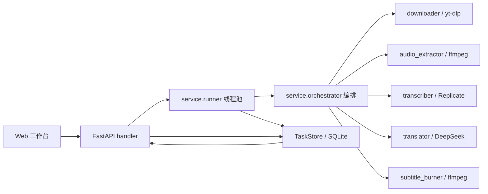

[English](./README.en.md) | 简体中文

# Subtitles AI · 字幕翻译工作台


Subtitles AI 是一个本地视频字幕翻译工作台。输入视频 URL 后，它会按流水线自动完成下载、音频提取、语音识别、字幕翻译和字幕烧录，输出带翻译字幕的视频与 SRT 文件。


## 1. 产品介绍

### 1.1 项目定位

本项目适合需要批量或半自动处理视频字幕的个人工作流：通过 Web 工作台查看任务进度，也可以用命令行直接跑完整流程。识别依赖 Replicate 托管 Whisper，翻译依赖 DeepSeek，视频处理依赖本机 FFmpeg。

### 1.2 功能展示

- 一条 URL 跑完整流程：下载视频、提取音频、识别字幕、翻译字幕、生成成品视频。
- Web 工作台支持任务创建、任务列表、实时进度、结果预览和产物下载。
- 命令行入口 `main.py` 支持目标语言、源语言、字幕模式、烧录方式和模型参数。
- 支持仅译文字幕或双语对照字幕。
- 支持硬烧录字幕和软字幕轨道。
- 每个任务的中间产物都保存在独立目录，便于排查和复用。

### 1.3 平台与技术支持

| 类型 | 支持情况 |
| --- | --- |
| 操作系统 | 当前仅支持并验证 macOS；Linux / Windows 尚未适配 |
| Python | `>=3.10,<3.13`，仓库当前 `.python-version` 为 `3.11` |
| 包管理 | uv |
| 后端 | FastAPI + Uvicorn |
| 前端 | 原生 HTML / CSS / JavaScript ES Modules |
| 存储 | SQLite，WAL 模式 |
| 视频处理 | yt-dlp、ffmpeg-full、ffprobe；硬烧录依赖 libass |
| 云服务 | Replicate、DeepSeek |

### 1.4 文档导航

- [快速开始](#2-快速开始)
- [配置与命令说明](#3-配置与命令说明)
- [系统架构与项目结构](#4-系统架构与项目结构)
- [开发者指南](#5-开发者指南)
- [贡献指南](#6-贡献指南)
- [安全漏洞报告](#64-安全漏洞报告)
- [版本管理](#7-版本管理)
- [许可证](#8-许可证)

### 1.5 AI 协作文档

仓库当前未发现 `AGENTS.md`、`CLAUDE.md` 或 `.github/copilot-instructions.md`。如需沉淀 AI Agent 协作规则，需要补充独立文档，README 只保留入口。

## 2. 快速开始

### 2.1 安装系统依赖与项目依赖

当前项目仅按 macOS 环境适配。请先通过 Homebrew 安装 `uv` 和带 `libass` 的 `ffmpeg-full`：

```bash
brew install uv
brew tap homebrew-ffmpeg/ffmpeg
brew install ffmpeg-full
```

请不要安装普通 `ffmpeg` 替代 `ffmpeg-full`。普通 `ffmpeg` 可能缺少 `libass`，会导致硬字幕烧录时报 `No such filter: 'subtitles'` 或字幕滤镜不可用。

确认系统依赖可用：

```bash
uv --version
ffmpeg -hide_banner -filters | grep " subtitles "
```

然后安装 Python 项目依赖：

```bash
uv sync
```

### 2.2 配置环境变量

仓库当前没有 `.env.example`，需要补充。首次运行前，请在项目根目录手动创建 `.env`：

```ini
REPLICATE_API_TOKEN=你的 Replicate Token
SUBTRANS_DEEPSEEK_API_KEY=你的 DeepSeek Key
```

`.env` 已在 `.gitignore` 中忽略。不要把真实密钥提交到仓库。

### 2.3 启动项目

推荐开两个终端运行后端和前端：

```bash
uv run uvicorn src.handler.app:app --reload --port 8000
```

```bash
python3 -m http.server 5273 --directory web
```

然后打开：

- Web 工作台：<http://localhost:5273>
- FastAPI 文档：<http://localhost:8000/docs>

### 2.4 验证启动成功

```bash
curl http://localhost:8000/api/health
```

成功时会返回：

```json
{"ok": true}
```

前端默认访问 `http://localhost:8000`。如需切换后端地址，可在浏览器控制台执行：

```js
localStorage.setItem("SUBTRANS_API_BASE_URL", "http://localhost:8000")
```

### 2.5 基础命令展示

不开 Web 页面时，可以直接用命令行处理一个视频：

```bash
uv run python main.py "<视频URL>"
```

```bash
uv run python main.py "<视频URL>" --target zh-CN --source auto --mode bilingual --burn hard --model small
```

## 3. 配置与命令说明

### 3.1 环境变量

| 变量名 | 是否必填 | 默认值 | 说明 |
| --- | --- | --- | --- |
| `REPLICATE_API_TOKEN` | 是 | 无 | Replicate API Token，用于语音识别 |
| `SUBTRANS_DEEPSEEK_API_KEY` | 是 | 无 | DeepSeek API Key，用于字幕翻译 |
| `DEEPSEEK_API_KEY` | 否 | 无 | DeepSeek Key 的兼容变量，未设置 `SUBTRANS_DEEPSEEK_API_KEY` 时使用 |
| `SUBTRANS_DATA_DIR` | 否 | `./data` | 任务产物根目录 |
| `SUBTRANS_DB` | 否 | `./app.db` | SQLite 任务库路径 |
| `SUBTRANS_WORKERS` | 否 | `2` | 后台流水线并发任务数 |
| `SUBTRANS_DL_FORMAT` | 否 | `bv*+ba/b` | yt-dlp 格式选择 |
| `SUBTRANS_DL_CONTAINER` | 否 | `mp4` | 下载合并后的容器格式 |
| `SUBTRANS_DL_RETRIES` | 否 | `3` | 下载失败重试次数 |
| `SUBTRANS_COOKIES` | 否 | 空 | cookies 文件路径，供需要登录或校验的网站使用 |
| `SUBTRANS_FFMPEG` | 否 | `ffmpeg` | ffmpeg 可执行文件 |
| `SUBTRANS_FFPROBE` | 否 | `ffprobe` | ffprobe 可执行文件 |
| `SUBTRANS_AUDIO_SR` | 否 | `16000` | 提取音频采样率 |
| `SUBTRANS_AUDIO_CH` | 否 | `1` | 提取音频声道数 |
| `SUBTRANS_WHISPER_MODEL` | 否 | `stayallive/whisper-subtitles:<locked-version>` | Replicate Whisper 模型标识 |
| `SUBTRANS_REPLICATE_TIMEOUT` | 否 | `1800` | Replicate 推理超时时间，单位秒 |
| `SUBTRANS_REPLICATE_RETRIES` | 否 | `3` | Replicate 网络或超时重试次数 |
| `SUBTRANS_DEEPSEEK_BASE_URL` | 否 | `https://api.deepseek.com` | DeepSeek OpenAI 兼容接口地址 |
| `SUBTRANS_DEEPSEEK_MODEL` | 否 | `deepseek-chat` | DeepSeek 模型名 |
| `SUBTRANS_TRANSLATE_BATCH` | 否 | `8` | 每批翻译字幕条数 |
| `SUBTRANS_TRANSLATE_TIMEOUT` | 否 | `60` | 单批翻译请求超时时间，单位秒 |

### 3.2 配置文件说明

- `.env`：本地敏感配置和运行参数，导入 `src.config.config` 或运行 `main.py` 时会自动加载。
- `web/config.js`：前端运行时配置，包括 `API_BASE_URL`、`USE_MOCK`、请求超时和翻译引擎列表。
- `pyproject.toml`：Python 依赖、包发现规则和 pytest 配置。

### 3.3 命令与参数说明

```bash
uv run python main.py "<视频URL>" [选项]
```

| 参数 | 默认值 | 说明 |
| --- | --- | --- |
| `url` | 必填 | 视频页面地址 |
| `-t, --target` | `zh-CN` | 目标语言 |
| `-s, --source` | `auto` | 源语言，默认自动检测 |
| `--mode` | `mono` | `mono` 仅译文，`bilingual` 双语对照 |
| `--burn` | `hard` | `hard` 硬烧录，`soft` 软字幕 |
| `--model` | `small` | Whisper 模型权重，例如 `tiny.en`、`small`、`medium` |
| `--task-id` | 自动生成 | 指定任务 ID，并决定产物目录 |

常用调试命令：

```bash
uv run python -m src.core.downloader "<URL>" <task_id>
uv run python -m src.core.audio_extractor data/<task_id>/source.mp4 <task_id>
uv run python -m src.core.transcriber data/<task_id>/audio.wav <task_id> en
uv run python -m src.core.translator data/<task_id>/original.srt <task_id> zh-CN mono
uv run python -m src.core.subtitle_burner data/<task_id>/source.mp4 data/<task_id>/translated.srt <task_id> hard
```

### 3.4 后端 API

完整交互文档见 <http://localhost:8000/docs>。

| 方法 | 路径 | 说明 |
| --- | --- | --- |
| `GET` | `/api/health` | 健康检查 |
| `POST` | `/api/tasks` | 创建任务并加入后台队列 |
| `GET` | `/api/tasks` | 获取任务列表 |
| `GET` | `/api/tasks/{id}` | 获取任务详情 |
| `DELETE` | `/api/tasks/{id}` | 删除任务和产物目录 |
| `POST` | `/api/tasks/{id}/retry` | 重置任务并重新入队 |
| `GET` | `/api/tasks/{id}/download` | 下载成品视频 |
| `GET` | `/api/tasks/{id}/subtitle` | 下载译文字幕 |
| `POST` | `/api/tasks/{id}/folder` | 打开本地任务目录 |
| `GET` | `/api/tasks/{id}/stream` | SSE 实时进度 |
| `GET` | `/api/srt/languages` | 获取源语言列表 |
| `GET` | `/api/srt/model-weights` | 获取模型权重列表 |

`POST /api/tasks` 请求体：

```json
{
  "url": "https://example.com/video",
  "sourceLang": "auto",
  "targetLang": "zh-CN",
  "mode": "mono",
  "burn": "hard",
  "model": "small",
  "engine": "deepseek"
}
```

## 4. 系统架构与项目结构

### 4.1 系统架构



流水线状态：

```text
PENDING -> DOWNLOADING -> EXTRACTING -> TRANSCRIBING -> TRANSLATING -> BURNING -> SUCCESS
```

任一步失败会进入 `FAILED`，并记录失败步骤和错误信息。

### 4.2 项目目录结构

```text
.
├── main.py                 命令行入口
├── pyproject.toml          依赖和 pytest 配置
├── uv.lock                 uv 锁文件
├── src/
│   ├── config/             全局配置和存储路径策略
│   ├── core/               下载、音频、识别、翻译、烧录和 SRT 工具
│   ├── service/            流水线编排、后台执行器和 SRT schema
│   ├── store/              SQLite 任务存储
│   └── handler/            FastAPI 路由
├── web/                    前端工作台
├── tests/                  pytest 测试
└── README——1.md            历史 README 材料
```

任务产物默认保存在 `data/{task_id}/`：

| 文件 | 说明 |
| --- | --- |
| `source.mp4` | 下载的视频 |
| `audio.wav` | 提取后的音频 |
| `original.srt` | 原文字幕 |
| `translated.srt` | 译文字幕 |
| `output.mp4` | 带字幕的成品视频 |

## 5. 开发者指南

### 5.1 本地开发

```bash
uv sync
uv run uvicorn src.handler.app:app --reload --port 8000
python3 -m http.server 5273 --directory web
```

前端如需脱离后端预览，可以在 `web/config.js` 中临时设置 `USE_MOCK: true`。

### 5.2 提交前检查

当前项目已有 pytest 测试配置。提交前建议至少运行：

```bash
uv run pytest -q
```

针对单个模块可运行：

```bash
uv run pytest tests/test_translator.py -q
```

联网端到端测试默认跳过；如需真实下载和调用云服务，可显式开启：

```bash
SUBTRANS_LIVE_TEST=1 uv run pytest tests/test_live_pipeline.py -v -s
```

### 5.3 云端 CI 验证

仓库当前未发现 `.github/workflows/`，需要补充 CI 配置。建议至少覆盖依赖安装、pytest、基础启动或健康检查。

## 6. 贡献指南

### 6.1 Issue

适合提交公开 Issue 的内容：

- Bug 反馈
- 功能建议
- 文档问题
- 可复现的使用问题

安全漏洞不要通过公开 Issue 提交。

### 6.2 Pull Request

建议流程：

1. Fork 本项目。
2. 创建功能分支。
3. 完成本地修改和必要检查。
4. 运行 `uv run pytest -q`。
5. 提交 Pull Request，并说明变更范围、验证方式和已知风险。

### 6.3 Commit 与分支规范

仓库当前未发现正式贡献规范，需要补充 `CONTRIBUTING.md`。提交信息建议使用清晰的动词前缀，例如：

```text
feat: add subtitle preview controls
fix: handle ffmpeg subtitle filter errors
docs: update README
```

### 6.4 安全漏洞报告

请不要在公开 Issue 中披露安全漏洞。仓库当前未发现 `SECURITY.md` 或安全披露邮箱，需要补充安全披露方式。

## 7. 版本管理

### 7.1 Release 与 Tag

项目版本在 `pyproject.toml` 中为 `0.1.0`。当前未发现明确的 Release 与 Tag 规则，需要补充发布策略。

### 7.2 更新日志

仓库当前未发现 `CHANGELOG.md`，需要补充更新日志。建议记录新功能、Bug 修复、性能优化和破坏性变更。

### 7.3 升级指南

当前未发现独立升级指南。涉及环境变量、数据目录、数据库结构或外部服务模型变更时，建议在更新日志中明确迁移步骤。

## 8. 许可证

仓库当前未发现 `LICENSE` 文件，需要补充许可证信息后再对外分发或开源。

## 9. 排障

| 现象 | 处理方式 |
| --- | --- |
| `Replicate` 请求超时 | 调大 `SUBTRANS_REPLICATE_TIMEOUT` 或 `SUBTRANS_REPLICATE_RETRIES`，并确认网络可访问 Replicate |
| 硬烧录失败或缺少 `subtitles` filter | 使用 Homebrew 安装 `ffmpeg-full`，不要安装普通 `ffmpeg`；或临时使用 `--burn soft` |
| 下载失败或需要登录 | 检查 URL 是否有效；必要时设置 `SUBTRANS_COOKIES` 指向 cookies 文件 |
| 前端无法连接后端 | 确认后端运行在 `http://localhost:8000`，或在浏览器 `localStorage` 中通过 `SUBTRANS_API_BASE_URL` 覆盖地址 |
| 翻译提示缺少 Key | 确认 `.env` 中配置了 `SUBTRANS_DEEPSEEK_API_KEY` 或 `DEEPSEEK_API_KEY`，并重启后端 |

## 10. 合规使用

本工具仅用于处理你有权访问、下载、转写、翻译和再发布的视频内容。使用前请确认目标网站服务条款、版权限制和所在地法律要求。
