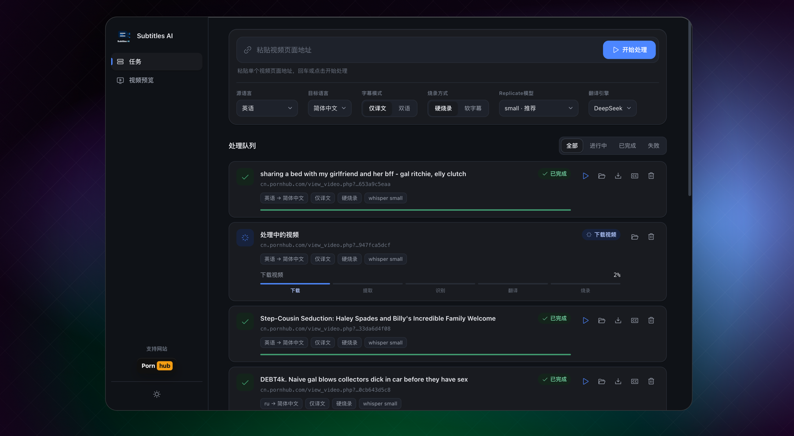

# Subtitles AI · 字幕翻译工作台


本地视频字幕处理台(目前已经打通Phub)。输入一个视频 URL，自动跑完整条流水线：**① 下载 → ② 提取音频 → ③ 语音识别 → ④ 翻译 → ⑤ 烧录字幕**，产出带翻译字幕的成品视频和字幕文件。



## 核心特性

- **一条 URL 全自动**：粘贴链接即触发下载、识别、翻译、烧录五步，无需手工干预。
- **两种入口**：Web 工作台（实时进度）与命令行（`main.py`），同一套核心逻辑。
- **实时进度**：后台线程池执行，SSE 推送每一步状态；前端「处理队列」平滑展示阶段轨道。
- **云端语音识别**：通过 [Replicate](https://replicate.com) 调用 Whisper，无需本地 GPU / 模型下载，带冷启动重试。
- **DeepSeek 翻译**：保留时间轴，仅译文或双语对照可选；批量翻译，数量不匹配自动减半重试。
- **软/硬字幕**：硬烧录嵌入画面（需 ffmpeg + libass），软字幕内封为可开关轨道。
- **单步可调试**：每一步都是独立模块，可单独用命令行跑，便于排查。

---

## 目录

- [技术栈](#技术栈)
- [前置要求](#前置要求)
- [快速开始](#快速开始)
- [环境变量参考](#环境变量参考)
- [架构总览](#架构总览)
- [命令行用法](#命令行用法)
- [后端接口](#后端接口)
- [产物位置](#产物位置)
- [测试](#测试)
- [项目结构](#项目结构)
- [排障](#排障)
- [已知限制与 TODO](#已知限制与-todo)
- [合规使用](#合规使用)

---

## 技术栈

| 层 | 选型 |
| --- | --- |
| 语言 | Python 3.11（`requires-python >=3.10,<3.13`） |
| 包管理 | [uv](https://docs.astral.sh/uv/) |
| Web 框架 | FastAPI + Uvicorn（`uvicorn[standard]`） |
| 任务存储 | SQLite（标准库 `sqlite3`，WAL 模式） |
| 异步执行 | 线程池（`ThreadPoolExecutor`，方案 A，无需 Redis） |
| ① 下载 | [yt-dlp](https://github.com/yt-dlp/yt-dlp) |
| ② 提取音频 / ⑤ 烧录 | ffmpeg / ffprobe（硬烧录需 libass） |
| ③ 语音识别 | Replicate 托管 Whisper（`stayallive/whisper-subtitles`，版本锁定） |
| ④ 翻译 | DeepSeek（OpenAI 兼容 `/chat/completions`），HTTP 走 httpx |
| 前端 | 纯 HTML / CSS / JS（ES Modules，无框架），Phosphor 图标 |
| 测试 | pytest |

---

## 前置要求

```bash
# 1. ffmpeg —— 硬烧录字幕依赖 libass，请装带 libass 的版本
brew tap homebrew-ffmpeg/ffmpeg
brew install ffmpeg-full
# 或官方版（较新 Homebrew 的 ffmpeg 也自带 libass）：
# brew install ffmpeg

# 2. uv（Python 包 / 环境管理）
# 见 https://docs.astral.sh/uv/
```

还需要两个云服务凭据（见 [配置 .env](#3-配置-env)）：

- **REPLICATE_API_TOKEN** —— 语音识别走 Replicate 云端 Whisper。
- **SUBTRANS_DEEPSEEK_API_KEY** —— 翻译走 DeepSeek。

> 验证 ffmpeg 是否带 libass：`ffmpeg -hide_banner -filters | grep " subtitles "`，有输出才能硬烧录。

---

## 快速开始

### 1. 安装依赖

```bash
uv sync
```

uv 会按 `.python-version`（3.11）创建虚拟环境并按 `uv.lock` 安装依赖。

### 2. 准备凭据

前往对应平台获取：

- Replicate Token：<https://replicate.com/account/api-tokens>
- DeepSeek Key：<https://platform.deepseek.com/>

### 3. 配置 .env

在项目根目录新建 `.env`：

```ini
REPLICATE_API_TOKEN=r8_xxx
SUBTRANS_DEEPSEEK_API_KEY=sk-xxx
```

> `.env` 在 `src/config/config.py` 导入时自动加载（`_bootstrap_env`），所以 uvicorn / pytest / CLI 各入口都能读到，无需手工 export。完整可选项见 [环境变量参考](#环境变量参考)。

### 4. 启动（Web 方式，推荐）

开两个终端：

```bash
# 终端 1：后端 API
uv run uvicorn src.handler.app:app --reload --port 8000

# 终端 2：前端静态页面
python3 -m http.server 5273 --directory web
```

浏览器打开 **<http://localhost:5273>**：

1. 在顶部命令栏粘贴视频链接，选好参数（源/目标语言、字幕模式、烧录方式、模型、引擎）。
2. 点「开始处理」，任务进入「处理队列」，阶段轨道实时推进。
3. 完成后可在队列或「视频预览」页在线播放、下载视频/字幕、打开本地文件夹。

后端交互式接口文档：<http://localhost:8000/docs>

> 前端默认走真实后端（`web/config.js` 中 `USE_MOCK: false`）。设为 `true` 可脱离后端用示例数据预览界面。运行时也可用 `localStorage.setItem('SUBTRANS_API_BASE_URL', 'http://...')` 覆盖后端地址。

---

## 环境变量参考

只有前两个是**必填**，其余都有默认值，本机开发一般不用动。

### 必填

| 变量 | 说明 | 获取方式 |
| --- | --- | --- |
| `REPLICATE_API_TOKEN` | ③ 语音识别（Replicate Whisper） | <https://replicate.com/account/api-tokens> |
| `SUBTRANS_DEEPSEEK_API_KEY` | ④ 翻译（也可用 `DEEPSEEK_API_KEY`） | <https://platform.deepseek.com/> |

### 可选（含默认值）

| 变量 | 默认 | 说明 |
| --- | --- | --- |
| `SUBTRANS_DATA_DIR` | `./data` | 任务产物根目录，按 `data/{task_id}/` 组织 |
| `SUBTRANS_DB` | `./app.db` | SQLite 任务库路径 |
| `SUBTRANS_WORKERS` | `2` | 后台流水线并发任务数（线程池大小） |
| `SUBTRANS_DL_FORMAT` | `bv*+ba/b` | yt-dlp 格式选择串 |
| `SUBTRANS_DL_CONTAINER` | `mp4` | 下载合并后的容器格式 |
| `SUBTRANS_DL_RETRIES` | `3` | 下载失败重试次数 |
| `SUBTRANS_COOKIES` | 空 | cookies 文件路径，供需要年龄校验 / 登录的站点使用 |
| `SUBTRANS_FFMPEG` | `ffmpeg` | ffmpeg 可执行文件（默认走 PATH） |
| `SUBTRANS_FFPROBE` | `ffprobe` | ffprobe 可执行文件 |
| `SUBTRANS_AUDIO_SR` | `16000` | 提取音频采样率（Whisper 标准输入） |
| `SUBTRANS_AUDIO_CH` | `1` | 提取音频声道数 |
| `SUBTRANS_WHISPER_MODEL` | `stayallive/whisper-subtitles:<版本>` | Replicate 模型标识（版本锁定） |
| `SUBTRANS_REPLICATE_TIMEOUT` | `1800` | Replicate 推理读超时（秒），冷启动久可调大 |
| `SUBTRANS_REPLICATE_RETRIES` | `3` | Replicate 超时/网络错误重试次数 |
| `SUBTRANS_DEEPSEEK_BASE_URL` | `https://api.deepseek.com` | DeepSeek 接口地址 |
| `SUBTRANS_DEEPSEEK_MODEL` | `deepseek-chat` | DeepSeek 模型名 |
| `SUBTRANS_TRANSLATE_BATCH` | `8` | 每批翻译多少条字幕（过长易截断 JSON，自动减半重试） |
| `SUBTRANS_TRANSLATE_TIMEOUT` | `60` | 单批翻译请求超时（秒） |

---

## 架构总览

分层清晰，依赖方向单一：`handler → service → core / store`。

```
                      ┌──────────────┐   HTTP + SSE   ┌───────────────────────┐
     浏览器 (web/) ───▶│ handler 接口层 │◀──────────────▶│  前端 ES Modules       │
                      └──────┬───────┘                └───────────────────────┘
                             │ 入队 / 查询
                      ┌──────▼───────┐        ┌──────────────┐
                      │ service 编排层 │──────▶ │ store (SQLite) │  任务状态 / 进度
                      │ orchestrator │◀────── │  app.db       │
                      │ runner(线程池) │        └──────────────┘
                      └──────┬───────┘
                             │ 逐步调用
          ┌──────────────────┼────────────────────────────────────┐
          ▼          ▼           ▼            ▼               ▼
      downloader  audio_extractor  transcriber  translator   subtitle_burner
       (yt-dlp)     (ffmpeg)      (Replicate)   (DeepSeek)    (ffmpeg+libass)
```

### 五步流水线

| 步骤 | 模块 | 输入 → 输出 |
| --- | --- | --- |
| ① 下载 | `src/core/downloader.py` | URL → `data/{id}/source.mp4` |
| ② 提取音频 | `src/core/audio_extractor.py` | `source.mp4` → `audio.wav`（16kHz 单声道） |
| ③ 语音识别 | `src/core/transcriber.py` | `audio.wav` → `original.srt`（Replicate Whisper） |
| ④ 翻译 | `src/core/translator.py` | `original.srt` → `translated.srt`（DeepSeek，保留时间轴） |
| ⑤ 烧录 | `src/core/subtitle_burner.py` | `source.mp4` + `translated.srt` → `output.mp4` |

编排在 `src/service/orchestrator.py`，把各步内部进度按权重映射到整体 0-100，并通过 `on_event` 回调抛状态。执行器 `src/service/runner.py` 用线程池跑编排，把事件写回 SQLite，SSE 端点轮询库表推给前端。

### 任务状态机

`PENDING → DOWNLOADING → EXTRACTING → TRANSCRIBING → TRANSLATING → BURNING → SUCCESS`，任一步失败转 `FAILED`（记录出错步骤与信息）。

### 数据库（`tasks` 表）

单表，SQLite（WAL，支持 API 进程读 + Worker 进程写）。字段：

```
id, url, source_lang, target_lang, mode, burn, model, engine,
status, progress, current_step, title, error,
output_video, output_subtitle, created_at, updated_at
```

### 前端结构（`web/`）

纯原生、无框架，ES Modules 拆分：

```
web/
├── index.html            外壳（侧边导航 + 任务视图 + 预览视图）
├── config.js             运行时配置（API 地址 / USE_MOCK / 引擎）
├── styles/               base / layout / console / queue / preview
└── js/
    ├── main.js           入口装配
    ├── store.js          单一状态源 + 发布订阅 + SSE 跟踪
    ├── api.js            RealApi(REST+SSE) / MockApi 按 config 切换
    ├── ui-console.js     任务控制台（命令栏 + 参数）
    ├── ui-queue.js       处理队列（横向任务行，节点复用保证进度平滑）
    ├── ui-preview.js     视频审片室
    ├── ui-shell.js       侧边导航 / 视图切换 / 筛选
    ├── theme.js toast.js constants.js utils.js
```

---

## 命令行用法

不开页面，一条命令跑完整链路：

```bash
uv run python main.py "<视频URL>"

# 带选项
uv run python main.py "<视频URL>" --target zh-CN --mode bilingual --burn hard --model small
```

| 参数 | 默认 | 说明 |
| --- | --- | --- |
| `-t/--target` | `zh-CN` | 目标语言 |
| `-s/--source` | `auto` | 源语言（自动检测） |
| `--mode` | `mono` | `mono` 仅译文 / `bilingual` 双语对照 |
| `--burn` | `hard` | `hard` 硬烧录 / `soft` 软字幕 |
| `--model` | `small` | Whisper 模型 `tiny.en` / `small` / `medium` … |
| `--task-id` | 自动生成 | 指定任务 ID（决定产物目录） |

### 单步调试

每一步都能单独跑，便于定位问题：

```bash
uv run python -m src.core.downloader        "<URL>" <task_id>
uv run python -m src.core.audio_extractor   data/<task_id>/source.mp4 <task_id>
uv run python -m src.core.transcriber       data/<task_id>/audio.wav <task_id> en
uv run python -m src.core.translator        data/<task_id>/original.srt <task_id> zh-CN mono
uv run python -m src.core.subtitle_burner   data/<task_id>/source.mp4 data/<task_id>/translated.srt <task_id> hard
```

---

## 后端接口

完整交互文档见 FastAPI：<http://localhost:8000/docs>。

| 方法 | 路径 | 说明 |
| --- | --- | --- |
| `GET` | `/api/health` | 健康检查 |
| `POST` | `/api/tasks` | 创建任务并加入后台队列 |
| `GET` | `/api/tasks` | 任务列表 |
| `GET` | `/api/tasks/{id}` | 任务详情 |
| `DELETE` | `/api/tasks/{id}` | 删除任务及其产物目录 |
| `POST` | `/api/tasks/{id}/retry` | 重置为 PENDING 并重新入队 |
| `GET` | `/api/tasks/{id}/download` | 下载成品视频 |
| `GET` | `/api/tasks/{id}/subtitle` | 下载译文字幕 |
| `POST` | `/api/tasks/{id}/folder` | 用系统文件管理器打开该任务本地目录 |
| `GET` | `/api/tasks/{id}/stream` | SSE 实时进度 |
| `GET` | `/api/srt/languages` | Replicate Whisper 支持的源语言列表（供前端下拉） |
| `GET` | `/api/srt/model-weights` | 支持的模型权重列表（供前端下拉） |

`POST /api/tasks` 请求体（camelCase，对齐前端契约）：

```json
{
  "url": "https://...",
  "sourceLang": "auto",
  "targetLang": "zh-CN",
  "mode": "mono",
  "burn": "hard",
  "model": "small",
  "engine": "deepseek"
}
```

> `folder` 接口仅适合本地工作台：浏览器不能直接打开本机目录，由本地后端代为调用系统文件管理器（macOS `open` / Windows `explorer` / Linux `xdg-open`）。

---

## 产物位置

每个任务一个目录 `data/{task_id}/`：

| 文件 | 来自 |
| --- | --- |
| `source.mp4` | ① 下载 |
| `audio.wav` | ② 提取音频 |
| `original.srt` | ③ 原文字幕 |
| `translated.srt` | ④ 译文字幕 |
| `output.mp4` | ⑤ 成品（带字幕） |

---

## 测试

```bash
uv run pytest              # 全部单测（快，默认不联网）
uv run pytest -q           # 简洁输出
uv run pytest tests/test_translator.py   # 单文件
```

联网的端到端集成测试默认跳过，需显式开启（会真实下载 / 调云端服务）：

```bash
SUBTRANS_LIVE_TEST=1 uv run pytest tests/test_live_pipeline.py -v -s
```

---

## 项目结构

```
.
├── main.py                 命令行入口
├── pyproject.toml          依赖 / pytest 配置
├── uv.lock  .python-version
├── app.db                  SQLite 任务库（gitignore）
├── data/{task_id}/         各任务产物（gitignore）
├── src/
│   ├── config/             全局配置（读 .env） + 存储路径策略
│   ├── core/               五步流水线 + ffmpeg / srt 工具
│   ├── service/            orchestrator 编排 + runner 执行器 + srt schema
│   ├── store/              SQLite 任务存储
│   └── handler/            FastAPI 路由（tasks / srt / health，按业务拆）
├── web/                    前端页面（原生，ES Modules）
└── tests/                  pytest 单测 + 联网集成测试
```

---

## 排障

| 现象 | 处理 |
| --- | --- |
| `Replicate 语音识别失败: The read operation timed out` | 模型冷启动慢。已内置 600~1800s 超时 + 重试；仍不够可调大 `SUBTRANS_REPLICATE_TIMEOUT` / `SUBTRANS_REPLICATE_RETRIES`。**改了后端代码需重启 uvicorn 才生效**（不带 `--reload` 时）。 |
| 硬烧录失败 / `No such filter: 'subtitles'` | ffmpeg 未编译 libass。装带 libass 的版本（见前置要求），或临时改用软字幕 `--burn soft`。 |
| 任务停在 `DOWNLOADING` / 下载 404 | 检查链接是否有效；部分站点需 cookies，配置 `SUBTRANS_COOKIES` 指向导出的 `cookies.txt`。 |
| 前端显示「无法连接后端」 | 确认后端已在 `http://localhost:8000` 运行；跨端口已开启 CORS。 |
| 翻译报缺 Key | 确认 `.env` 里 `SUBTRANS_DEEPSEEK_API_KEY` 已配置且后端已重启（`.env` 在导入期读取）。 |
| 端口 5273 / 8000 被占用 | `lsof -ti :5273 \| xargs kill`，或换端口启动。 |

---

## 已知限制与 TODO

1. **缓存复用**：保留视频 / 音频 / SRT 等中间产物，某步失败后重跑不必从零开始；若仅翻译选项不同，可复用已识别的 SRT。
2. **进度占比**：五步各占 20%（现为按阶段权重分布）。
3. **僵尸任务** ⚠️：线程模型下后端重启，正在跑的任务会停在 `DOWNLOADING/TRANSCRIBING` 不动。应在启动时把非终态任务标记为 FAILED 或重新入队。
4. **遗留依赖**：`pyproject.toml` 仍列 `faster-whisper`（已切换到 Replicate 云端识别，可清理）。

---

## 合规使用

本工具用于对**你有权处理**的视频进行字幕生成与翻译。请遵守目标网站的服务条款、所在地法律与版权规定，仅在获得授权的场景下使用。
