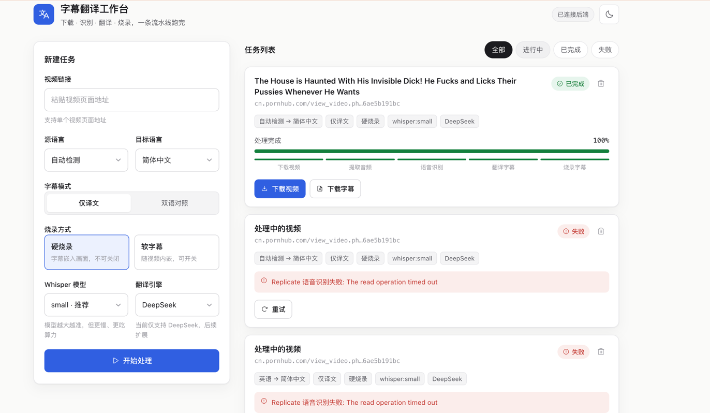

# 字幕翻译工作台

输入一个视频 URL，自动跑完整条流水线：**下载 → 提取音频 → 语音识别 → 翻译 → 烧录字幕**，产出带翻译字幕的视频。


页面展示

---

## 1. 前置要求

```bash
# ffmpeg（硬烧录需要带 libass 的版本）
brew tap homebrew-ffmpeg/ffmpeg
brew install ffmpeg-full
# 或官方版： brew install ffmpeg

# uv（Python 包管理）
# https://docs.astral.sh/uv/
```

- **语音识别**走 [replicate.com](https://replicate.com)（云端 Whisper，需 API Token）
- **翻译**走 DeepSeek（需 API Key）

## 2. 安装依赖

```bash
uv sync
```

## 3. 配置 .env

在项目根目录建 `.env`：

```ini
REPLICATE_API_TOKEN=r8_xxx
SUBTRANS_DEEPSEEK_API_KEY=sk-xxx
```

可选项（不填用默认值）：

```ini
SUBTRANS_REPLICATE_TIMEOUT=600   # 识别读超时(秒)，冷启动久可调大
SUBTRANS_REPLICATE_RETRIES=3     # 识别超时重试次数
SUBTRANS_WORKERS=2               # 后台并发任务数
SUBTRANS_COOKIES=/path/cookies.txt  # 年龄校验/登录站点用
```

---

## 4. 启动（Web 方式，推荐）

开两个终端：

```bash
# 终端 1：后端 API
uv run uvicorn src.handler.app:app --reload --port 8000

# 终端 2：前端页面
python3 -m http.server 5273 --directory web
```

浏览器打开 **http://localhost:5273**，粘贴视频链接、选好选项，点「开始处理」，进度条会实时走，完成后出现下载按钮。

> 后端接口文档：http://localhost:8000/docs

## 5. 命令行方式（不开页面）

一条命令跑完整链路：

```bash
uv run python main.py "<视频URL>"
# 带选项
uv run python main.py "<视频URL>" --target zh-CN --mode bilingual --burn hard --model small
```

| 参数 | 默认 | 说明 |
|------|------|------|
| `-t/--target` | `zh-CN` | 目标语言 |
| `-s/--source` | `auto` | 源语言（自动检测） |
| `--mode` | `mono` | `mono` 仅译文 / `bilingual` 双语 |
| `--burn` | `hard` | `hard` 硬烧录 / `soft` 软字幕 |
| `--model` | `small` | Whisper 模型 `tiny.en`/`small`/`medium`… |

### 单步调试（也可单独跑某一步）

```bash
uv run python -m src.core.downloader        "<URL>" <task_id>
uv run python -m src.core.audio_extractor   data/<task_id>/source.mp4 <task_id>
uv run python -m src.core.transcriber       data/<task_id>/audio.wav <task_id> en
uv run python -m src.core.translator        data/<task_id>/original.srt <task_id> zh-CN mono
uv run python -m src.core.subtitle_burner   data/<task_id>/source.mp4 data/<task_id>/translated.srt <task_id> hard
```

## 6. 产物位置

每个任务一个目录 `data/{task_id}/`：

| 文件 | 来自 |
|------|------|
| `source.mp4` | ① 下载 |
| `audio.wav` | ② 提取音频 |
| `original.srt` | ③ 原文字幕 |
| `translated.srt` | ④ 译文字幕 |
| `output.mp4` | ⑤ 成品（带字幕） |

## 7. 测试

```bash
uv run pytest                # 全部单测（快，不联网）
uv run pytest -q             # 简洁输出
```

---

## 项目结构

```
src/
├── handler/   HTTP 接口层（FastAPI 路由，按业务拆）
├── service/   编排 orchestrator + 执行器 runner
├── core/      五步流水线 + ffmpeg/srt 工具
├── store/     SQLite 任务存储
└── config/    全局配置（读 .env）
web/           前端页面（纯 HTML/CSS/JS）
main.py        命令行入口
```

---

## TODO

1. **缓存复用**：保留视频/音频/SRT 等中间产物，某步失败后重跑不必从零开始；若仅翻译选项不同，可复用已识别的 SRT。
2. **进度占比**：五步各占 20%（现为按阶段权重分布）。
3. **僵尸任务** ⚠️：线程模型下后端重启，正在跑的任务会停在 `DOWNLOADING/TRANSCRIBING` 不动。应在启动时把非终态任务标记为 FAILED 或重新入队。
